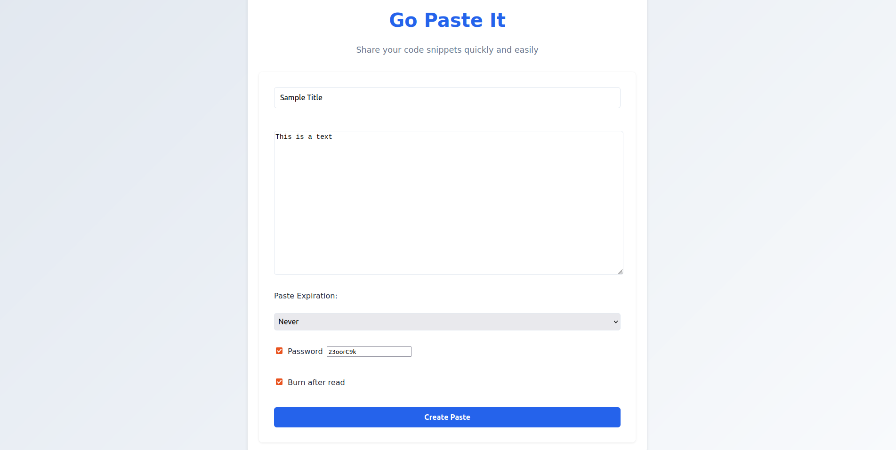

# go-paste-it
Create shareable snippets of text. Get a URL to share it with anyone
## Overview
- Create and view pastes with unique URLs
- Optional password protection for pastes
- Burn after view

## Planned Features

- Private Pastes
- APIs to create pastes

## App



## Prerequisites

docker

## Run in Docker

```
docker-compose up -d
```

## Local Build and Run

Run mongodb in localhost

```
EXPORT MONGODB_URI = mongodb://localhost:27017
go -o build app && ./app
```
